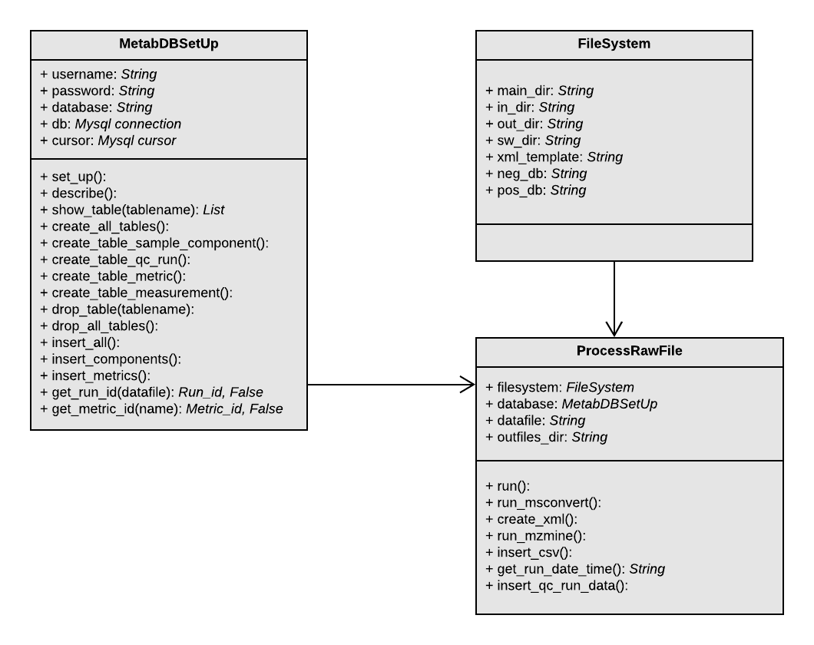

# Metabolomics Quality Control Pipeline

This is the GitHub repo for the Metabolomics QC pipeline.  

### Current Development
* The Database module will create a database for the short report data when run as a script.  
A MySQL database is required. 
* The Process Raw Files Module will run both msconvert and mzmine on all raw files in a directory.
The files generated are stored and data from the mzmine csv output is inserted into the database.
To run this file, input the raw/txt file directory as an argument eg.

  _python Metabolomics_Process_Raw_Files.py "Z:\Metabolomics\QC_runs\C1_Clayton"_

* A software directory is needed in the main directory with ProteoWizard and Mzmine-2.32 installed.
The directory structure needed is:

Software
    Mzmine-2.32
    ProteoWizard

### Next Development
* Demo visualizations in current interface

### Class Diagram

### ER Diagram

