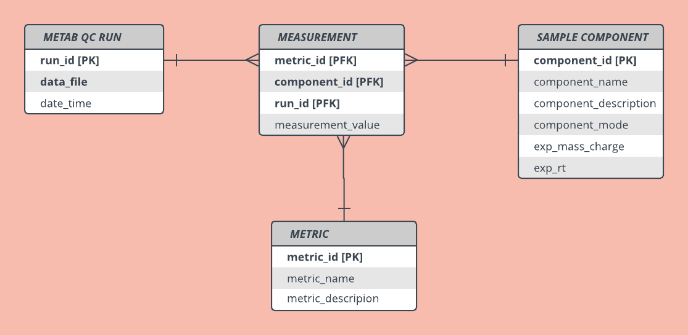

# Metabolomics Quality Control Pipeline

This is the GitHub repo for the Metabolomics QC pipeline.  

### Current Development
* The Database module will create a database for the short report data when run as a script.  
A MySQL database is required. 
* The Parse Input module will insert one short report file into the database or all the test files when run as a script.

### Next Development
* Incorporate Ideom and .raw processing outputs
* Demo visualizations in current interface

### ER Diagram

